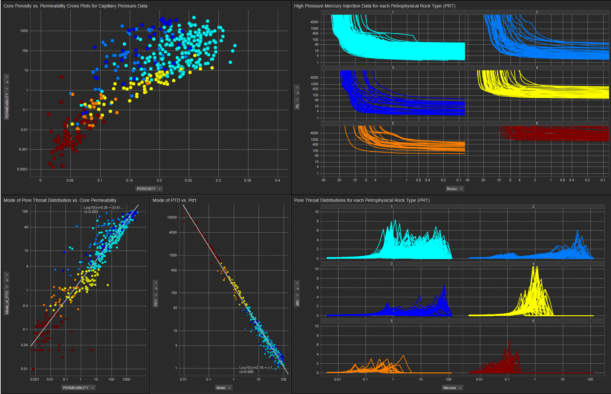

# Simple-Neural-Network-to-Estimate-Rock-Types-Rock-Types
We have developed a simple, 1 layer neural network to estimate Macro, Meso and Micro Rock Types
### Introduction
#### Predict Macro, Meso and Micro Rock Types (RT)
The objective of this project is to estimate Macro, Meso and Micro Rock Types (RTs). In this repository we are using a simple this single layer neural network to predict our RT. Therefore, we modified the Petrophysical Rock Types (PRT) as defined by Clerke(1) for the Arab-D carbonate reservoir. The objective is to use just Porosity and Permeability to estimate our Macro, Meso or Micro RT.

The Arab D data set published by Clerke is quite distinctive. Clerke acquired nearly 450 High Pressure Mercury Injection Capillary Pressure (HPMI) measurements in the Arab D reservoir; however, Clerke's final samples were randomly selected from 1,000's of pre-qualified core samples ensuring a broad distribution and representation of all Petrophysical properties. This created one of the best Core Analysis datasets every collected in our industry. 

Clerke began evaluating this dataset by fitting a Thomeer hyperbolas for each pore system in each sample to generate the published Thomeer Capillary Pressure parameters. From these data Clerke established his Petrophysical Rock Types (PRT) based on the Initial Displacement Pressures for each pore system and the number of pore systems present in each sample. From the figure below it is rather evident that Clerke's PRTs are Petrophysically well-defined in poro-perm space where each color represents a different PRT.  The Capillary Pressure curves and Pore Throat Distributions (PTD) shown on the right hand side of the figure illustrate the unique characteristics of each PRT. 

###### The characterization of Clerke's PRTs are shown below:

As can be seen in the first figure above, the PRTs are rather well segregated in the Porosity vs. Permeability Cross Plot as they fall in distinct regions or clusters on the Cross Plot.For modeling purposes it is important to take advantage of the excellent correlations between the PRTs. 

The first part of this notebook develops our single layer neural network as inspired by the video series from giant_neural_network on YouTube. 

https://www.youtube.com/watch?v=LSr96IZQknc

We used Clerke's Rosetta Stone data and his PRTs as our training set, except that we combined all the macros PRTs into one RT that had a value of 2. We combined all the Type 1 Meso PRT into a RT with a value of 1 and all the Micro PRT compose our third RT with a value of 0. The following is a standard Sigmoid s-curve.

We have expanded our Sigmoid curve for values from 0 to 2 to accomodate our RT.
 
        def sigmoid(x):
            return 2/(1 + np.exp(-x))

We first calculate a variable z which is a function if weights and bias:
        
        z = Porosity * weight1 + permeability * weight2 + bias

Our prediction (pred) is then a function of sigmoid:        
        
        pred = sigmoid(z) 

where sigmoid is defined by:
        
        def sigmoid(x):
            return 1/(1 + np.exp(-x))

The term z is actually the x-axis on the above sigmoid curve, and y is a function of sigmoid(z). 

For training we make about 1,000 iterations to optimize on the weights (w1 and w2) and bias for our single layer. These weights can be saved and then used in future projects to estimate RT from the user's input of Porosity and log10 of Permeability. We can calculates the most probable Rock Type and even provide Capillary Pressure curves for each Rock Type.

In this example z is calculated:
        
        z = porosity * weight1 + permeability * weight2 + bias

and then pred is a function of sigmoid(z). 
        
        pred = sigmoid(z) 

The final RT are defined as shown below:
        
        if pred > 1.7:
            RT=2
        elif pred < 0.25:
            RT=0
        else:
            RT=1
            

1 Clerke, E. A., Mueller III, H. W., Phillips, E. C., Eyvazzadeh, R. Y., Jones, D. H., Ramamoorthy, R., Srivastava, A., (2008) “Application of Thomeer Hyperbolas to decode the pore systems, facies and reservoir properties of the Upper Jurassic Arab D Limestone, Ghawar field, Saudi Arabia: A Rosetta Stone approach”, GeoArabia, Vol. 13, No. 4, p. 113-160, October, 2008. 

